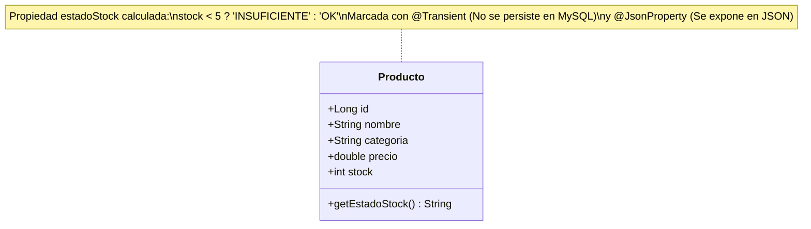

# 🛒 REST API Robustness & Bean Validation Architecture (Lab 05A)

[](https://spring.io/projects/spring-boot)
[](https://openjdk.org/)
[](https://www.mysql.com/)
[](https://beanvalidation.org/)
[](https://junit.org/junit5/)
[](LICENSE)

> **Repositorio de Portafolio Profesional** desarrollado para la asignatura *Soluciones Web y Aplicaciones Distribuidas* (Universidad Privada del Norte). Implementa las mejores prácticas de la industria en diseño de APIs RESTful resilientes, validación declarativa en el servidor, desacoplamiento arquitectónico y manejo centralizado de excepciones.

---

## 📌 Resumen Ejecutivo para Reclutadores Técnicos / RRHH

En aplicaciones web y distribuidas de nivel corporativo, una API no debe considerarse completa únicamente porque persiste registros en una base de datos. Una solución robusta debe:
1. **Garantizar la integridad de datos en la frontera**: Rechazar entradas corruptas o incompletas antes de invocar la capa de persistencia mediante **Jakarta Bean Validation (JSR-380)**.
2. **Comunicación semántica estricta**: Responder con códigos de estado HTTP precisos (`200 OK`, `201 Created`, `204 No Content`, `400 Bad Request`, `404 Not Found`, `409 Conflict`), evitando el antipatrón de devolver siempre `200 OK` con mensajes de error encapsulados en el cuerpo.
3. **Mantenibilidad y Clean Code**: Centralizar el tratamiento de excepciones mediante programación orientada a aspectos (AOP) con `@RestControllerAdvice`, erradicando bloques `try-catch` redundantes en la capa de controladores.
4. **Separación de responsabilidades**: La entidad `Producto` gestiona la persistencia y reglas de validación; el servicio orquesta transacciones y lógica de dominio; el controlador atiende peticiones HTTP; y el manejador global transforma excepciones en respuestas JSON uniformes.

---

## 🏗️ Arquitectura del Sistema y Flujo de Peticiones

```mermaid
flowchart TD
    Client(["Cliente HTTP (Postman / Frontend Angular)"]) -->|HTTP Request con JSON| Controller["ProductoController\n(@RestController)"]
    Controller -->|@Valid activa validaciones| Validator{"¿Datos Válidos?"}
    
    Validator -- No --> Adv["GlobalExceptionHandler\n(@RestControllerAdvice)"]
    Adv -->|HTTP 400 Bad Request\n(Desglose de errores por campo)| Client
    
    Validator -- Sí --> Service["ProductoService\n(@Service @Transactional)"]
    Service -->|existsByNombreIgnoreCase| Repo["ProductoRepository\n(@Repository JpaRepository)"]
    
    Repo -->|Comprobación de unicidad| DupCheck{"¿Nombre Duplicado?"}
    DupCheck -- Sí --> DupEx["Lanza ProductoDuplicadoException"]
    DupEx --> Adv
    Adv -->|HTTP 409 Conflict\n(JSON de Conflicto)| Client
    
    DupCheck -- No --> DB[("Base de Datos MySQL\n(bd_swad_lab05)")]
    DB -->|Entidad persistida| Service
    Service -->|Cálculo dinámico @Transient estadoStock| Controller
    Controller -->|HTTP 200 / 201 / 204\nResponseEntity Semántico| Client
```

---

## 🧩 Modelo de Datos y Entidad `Producto`



### Reglas Declarativas de Bean Validation
- **`nombre`**: `@NotBlank(message = "El nombre es obligatorio")`, `@Size(min = 3, max = 80)`
- **`categoria`**: `@NotBlank(message = "La categoría es obligatoria")`, `@Size(min = 3, max = 40)` *(Actividad guiada)*
- **`precio`**: `@Positive(message = "El precio debe ser mayor que cero")`
- **`stock`**: `@PositiveOrZero(message = "El stock no puede ser negativo")`
- **`estadoStock`**: Calculado dinámicamente en tiempo de ejecución.

---

## 📑 Catálogo de Endpoints y Contratos REST

| Método HTTP | Endpoint | Descripción | Códigos HTTP Retornados |
| :---: | :--- | :--- | :---: |
| `GET` | `/api/productos` | Listado general de productos | `200 OK` |
| `GET` | `/api/productos/{id}` | Búsqueda de producto por ID | `200 OK`, `404 Not Found` |
| `POST` | `/api/productos` | Creación de nuevo producto | `201 Created`, `400 Bad Request`, `409 Conflict` |
| `PUT` | `/api/productos/{id}` | Actualización completa de producto | `200 OK`, `400 Bad Request`, `404 Not Found`, `409 Conflict` |
| `DELETE` | `/api/productos/{id}` | Eliminación física del registro | `204 No Content`, `404 Not Found` |
| `GET` | `/api/productos/buscar?nombre=LG` | Búsqueda por coincidencia de nombre | `200 OK` |

---

## 🛡️ Formatos Uniformes de Error JSON (`@RestControllerAdvice`)

### 1. Error 400 Bad Request (Fallo de Validación)
```json
{
  "fecha": "2026-09-19T15:30:00.123456",
  "estado": 400,
  "error": "Bad Request",
  "validaciones": {
    "nombre": "El nombre es obligatorio",
    "categoria": "La categoría es obligatoria",
    "precio": "El precio debe ser mayor que cero",
    "stock": "El stock no puede ser negativo"
  }
}
```

### 2. Error 404 Not Found (Recurso Inexistente)
```json
{
  "fecha": "2026-09-19T15:30:00.123456",
  "estado": 404,
  "error": "Not Found",
  "mensaje": "No existe el producto con id 999"
}
```

### 3. Error 409 Conflict (Nombre Duplicado - Reto Adicional)
```json
{
  "fecha": "2026-09-19T15:30:00.123456",
  "estado": 409,
  "error": "Conflict",
  "mensaje": "Ya existe un producto registrado con el nombre: Monitor LG 24"
}
```

---

## 🧪 Pruebas Automatizadas con MockMvc (JUnit 5)

El repositorio cuenta con una suite completa de pruebas de integración con `MockMvc` (`ProductoControllerTest.java`), que valida de forma automatizada:
- ✅ Consulta de productos y cálculo correcto de `estadoStock` (`200 OK`).
- ✅ Creación con payload válido (`201 Created`).
- ✅ Rechazo automático de payloads con datos vacíos o negativos (`400 Bad Request`).
- ✅ Prevención de registros duplicados de nombres (`409 Conflict`).
- ✅ Búsqueda de recursos inexistentes (`404 Not Found`).
- ✅ Eliminación exitosa sin cuerpo de respuesta (`204 No Content`).

Para ejecutar los tests automatizados:
```powershell
.\mvnw.cmd clean test
```

---

## 🚀 Guía de Instalación y Ejecución Local

### Prerrequisitos
- **Java JDK 17** o superior instalado.
- **MySQL Server 8.0** en ejecución (puerto 3306).
- Base de datos creada:
  ```sql
  CREATE DATABASE IF NOT EXISTS bd_swad_lab05;
  ```

### Pasos de Ejecución
1. **Clonar el repositorio:**
   ```bash
   git clone https://github.com/Orlandho/spring-boot-rest-validations-and-errors.git
   cd spring-boot-rest-validations-and-errors
   ```
2. **Configurar credenciales (opcional vía variables de entorno):**
   ```powershell
   $env:SPRING_DATASOURCE_USERNAME = "root"
   $env:SPRING_DATASOURCE_PASSWORD = "TU_CONTRASEÑA"
   ```
3. **Compilar y arrancar la aplicación:**
   ```powershell
   mvn spring-boot:run
   ```
4. **Probar endpoints:**
   Utilizar el archivo [`requests.http`](requests.http) integrado con extensiones como REST Client en VS Code / IntelliJ.

---

## 💡 Preguntas de Análisis y Comprobación Técnica

1. **¿Qué diferencia existe entre validar en el frontend y validar en el backend?**
   *Respuesta:* La validación en el frontend mejora la experiencia de usuario (UX) ofreciendo retroalimentación inmediata, pero es fácilmente eludible (mediante Postman, cURL o manipulación del DOM). La validación en el backend actúa como la barrera de seguridad infranqueable que garantiza la consistencia, integridad y validez de los datos antes de alcanzar la base de datos.
2. **¿Por qué `@Valid` debe colocarse en los parámetros que reciben el JSON?**
   *Respuesta:* La anotación `@Valid` instruye a Spring MVC para que active el validador de Bean Validation (Hibernate Validator) sobre el objeto deserializado a partir del cuerpo de la petición (`@RequestBody`). Si no se coloca, las anotaciones de validación dentro de la clase (`@NotBlank`, `@Positive`) son ignoradas en el controlador.
3. **¿Qué ventaja ofrece `@RestControllerAdvice` frente a repetir `try/catch` en cada endpoint?**
   *Respuesta:* Implementa el principio de responsabilidad única (SRP) y DRY (Don't Repeat Yourself). Desacopla la lógica de negocio del manejo de anomalías, elimina código repetitivo en los controladores y garantiza un formato de error homogéneo y predecible para todo el sistema.
4. **¿Por qué `estadoStock` no necesita almacenarse en MySQL?**
   *Respuesta:* Porque es un dato derivado o calculado en tiempo de ejecución a partir del atributo `stock`. Almacenarlo rompería las formas normales de bases de datos relacionales, introduciría redundancia y generaría riesgos de inconsistencia si el stock se modifica sin actualizar el estado.

---

## 👤 Autor
**Orlando Dorival**  
Estudiante de Ingeniería de Sistemas Computacionales  
Universidad Privada del Norte (UPN) | Universidad Nacional de Ingeniería (UNI)  
GitHub: [@Orlandho](https://github.com/Orlandho)
